# IBM Bob IDE Labs for App Connect Enterprise Toolkit

## Overview

[Build integration projects faster with IBM Bob and App Connect Enterprise](https://developer.ibm.com/tutorials/accelerate-integration-development-app-connect-ibm-bob/)

## Prerequisites

Before starting these labs, ensure you have the following installed and configured.

### Required Software

1. **IBM App Connect Enterprise Toolkit** (version 13.0.7.0 or later)
   - Download from [IBM](https://www.ibm.com/docs/en/app-connect/13.0.x?topic=gsace-download-app-connect-enterprise-evaluation-edition-get-started)
   - Ensure the toolkit is properly installed and configured.

2. **IBM Bob IDE**
   - Install the Bob IDE.
   - Configure Bob with ACE Developer mode.

3. **Java Development Kit (JDK)**
   - JDK 8 or later (required for ACE Toolkit).
   - Set the `JAVA_HOME` environment variable.

### System Requirements
- **Network:** Internet connection for downloading resources and accessing remote servers.

### Optional Tools
- **API Testing Tool:** Postman or cURL (for testing endpoints).
- **Git:** For version control (optional).

> **Note:** Complete all prerequisites before starting the labs.

---

## Lab 1: MCP Server

### Prerequisites

- Ensure your IBM App Connect Enterprise Integration Node is up and running.
- Ensure the App Connect Dashboard (Web UI) is initialized and connected to manage your target integration runtimes/nodes.

### Steps

#### Step 1: Access the Tutorials Gallery

1. Open your IBM App Connect Enterprise Toolkit.
2. Click **Help** in the top menu bar.
3. Select **Tutorials Gallery** from the drop-down menu.
4. Locate the **OpenAPI Specification v3 - Using an example REST API** tutorial from the catalog.


5. Follow the steps in the tutorial to import and prepare for deployment.

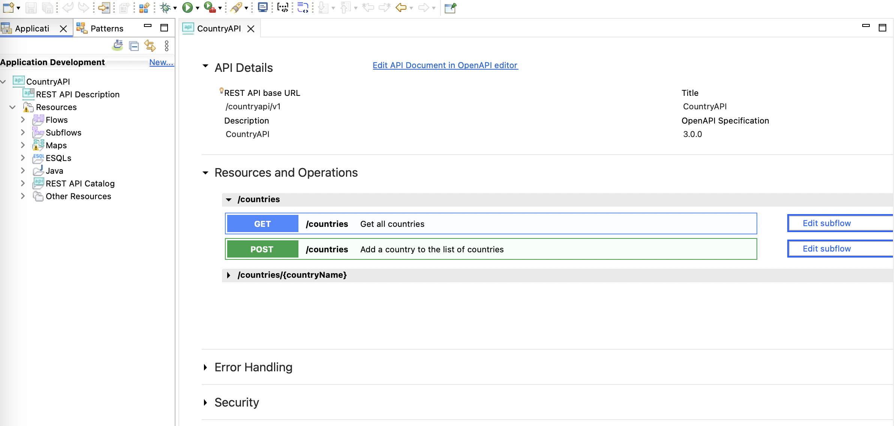

#### Step 2: Create an Integration Node

To create an Integration Node (formerly known as a Broker) in IBM App Connect Enterprise (ACE), open the Integration Console via `IBM ACE Toolkit` → `Open Integration Console`, then run the following commands.

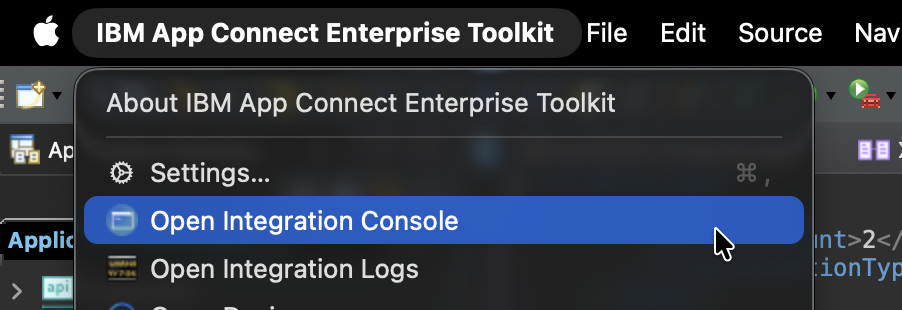

- **Create an integration node:**

  ```bash
  mqsicreatebroker <IntegrationNodeName>
  ```

- **Start the integration node:**

  ```bash
  mqsistart <IntegrationNodeName>
  ```

- **Create an integration server targeting your node:**

  ```bash
  ibmint create server <YourServerName> --integration-node <IntegrationNodeName>
  ```

#### Step 3: Create a BAR File for CountryAPI

1. Open the Integration Development perspective.
2. Click `File` → `New` → `BAR File`.
   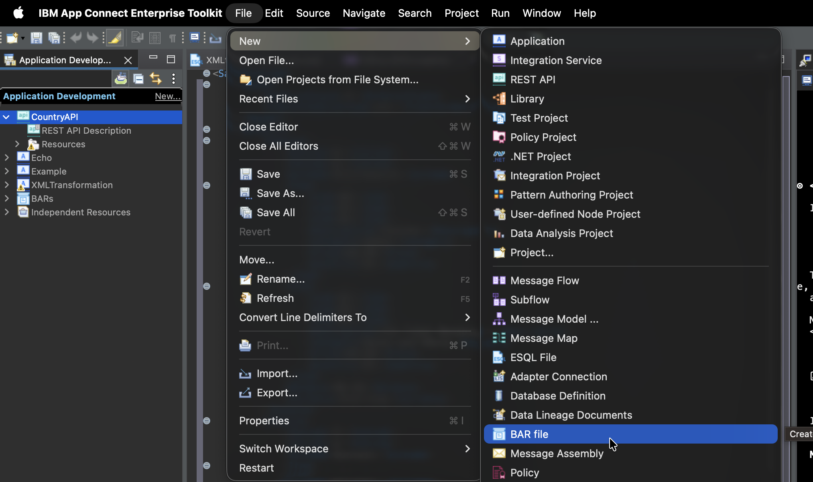
3. Enter a name such as `countryAPI` and click `Finish`.
4. Select `CountryAPI` under **REST APIs**.
   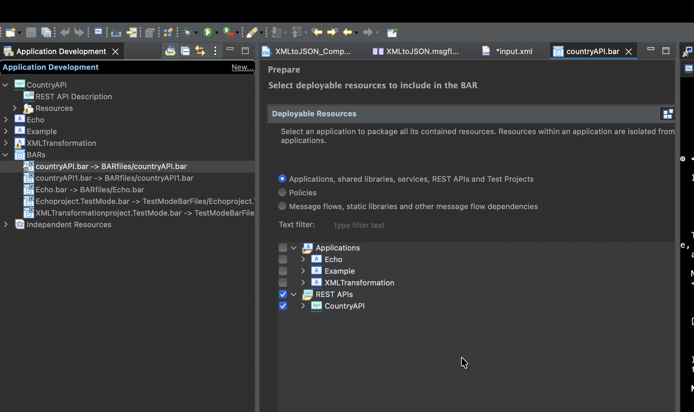

#### Step 4: Deploy a BAR File to an Integration Server

1. Navigate to the **Integration Nodes** view pane.
2. Ensure your target Integration Node and Integration Server are started.
   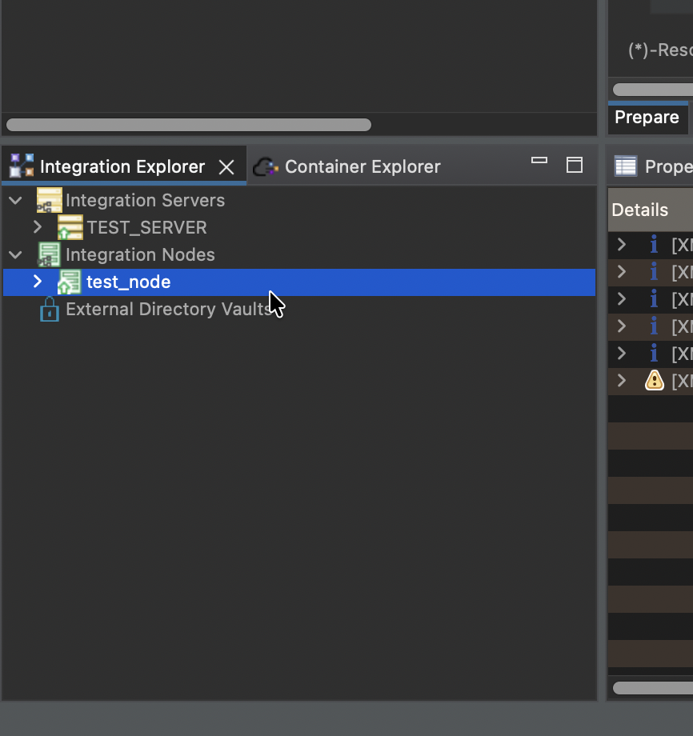
3. Choose one of the following deployment methods:
   - **Drag and drop:** Drag the BAR file from your workspace directly onto the target integration server.
   - **Right-click deploy:** Right-click the BAR file, select **Deploy**, choose your target integration node/server, and click **Finish**.
   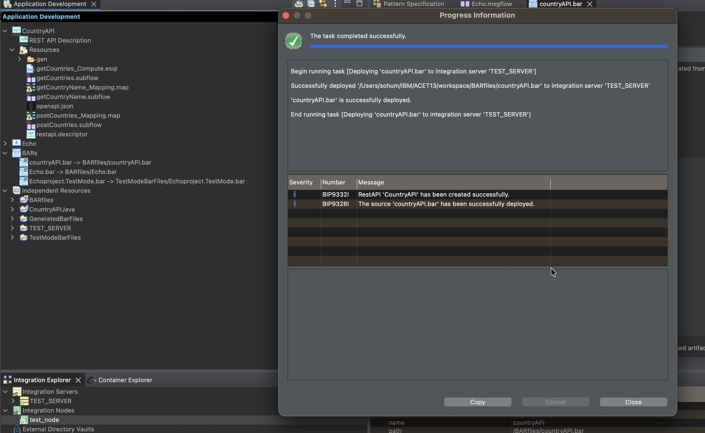

#### Step 5: Create and Configure an MCP Server

Now, create a Model Context Protocol (MCP) server to enable Bob IDE integration with your App Connect Enterprise deployment.

##### Step 5.1: Access the Web UI from the Toolkit

1. **Locate the node:** Go to the **Integration Explorer** view (usually located in the bottom-left panel).
2. **Connect to the node:** Ensure your integration node is active and connected.
3. **Verify server status:** Ensure your Integration Server is active and running.
   
4. **Launch the Web UI:** Right-click your target integration node and select **Start Web User Interface**.
   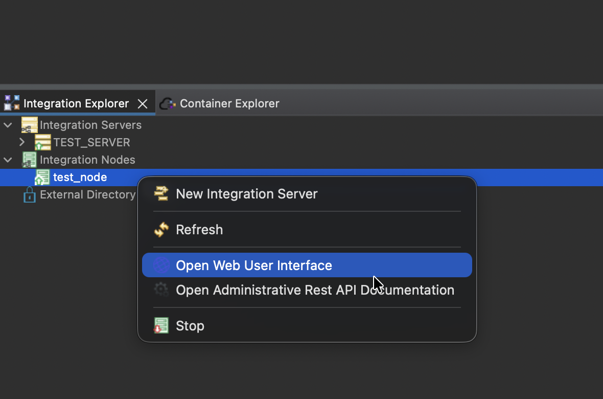
5. **Locate the application:** In the dashboard, find your deployed application in the server list.
   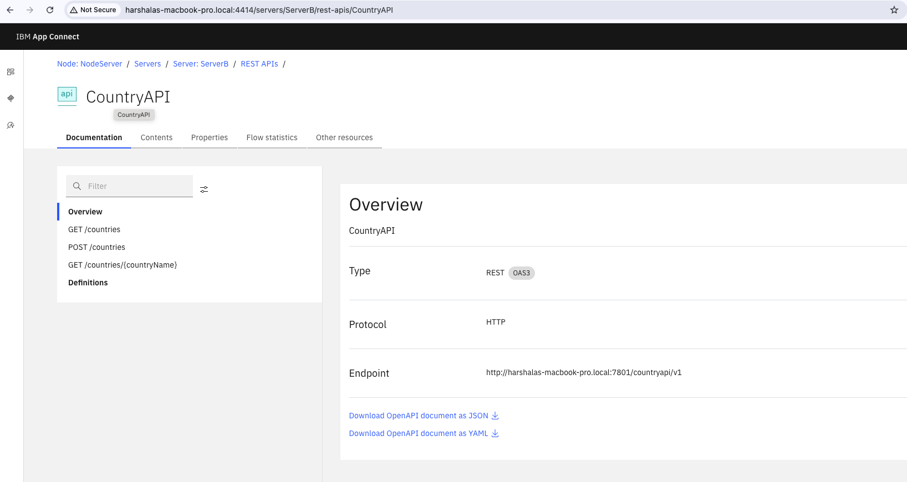

##### Step 5.2: Create the MCP Server in ACE Toolkit Web UI

1. **Navigate to MCP Server:** Click **Configure MCP Server** in the extra options menu on the dashboard.
   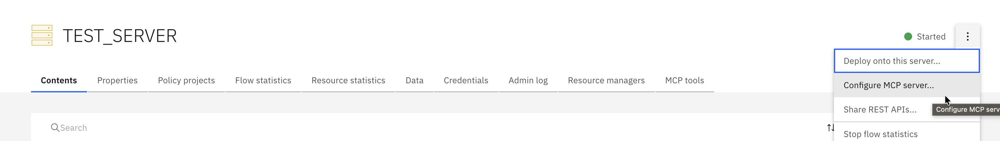
2. **Create a new server:** Click **Create an MCP Server**.
   - Select a port and click **Next**.
   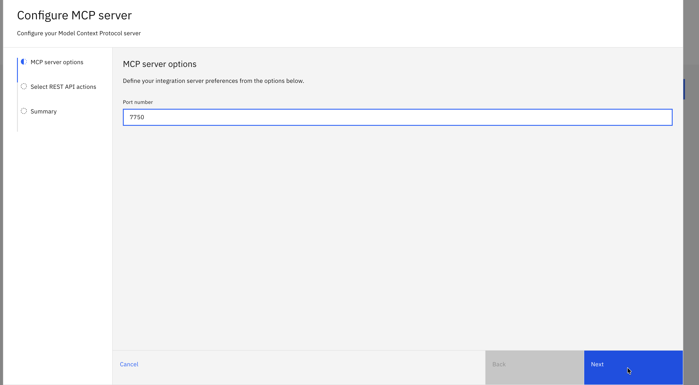
   - Select the API routes to be accessible and click **Next**.
   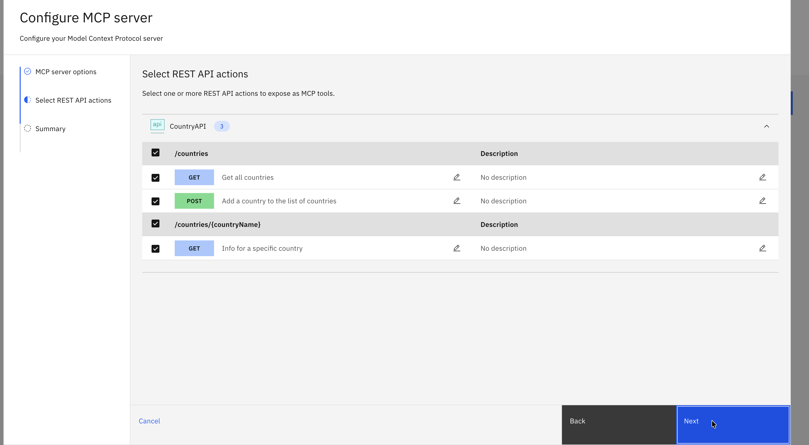
   - Review the settings and click **Create**.

##### Step 5.3: Configure MCP Server in Bob IDE

1. **Open Bob IDE:** Launch Bob IDE and open your project.
2. **Create a project-level MCP server configuration:** Go to Bob settings and create a project-level MCP server configuration.
   - Open Bob settings.
   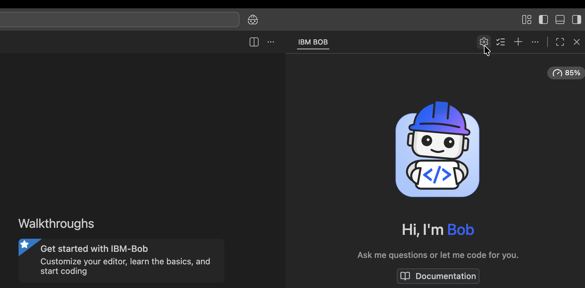
   - Navigate to **MCP menu** → **Add MCP Server**.
   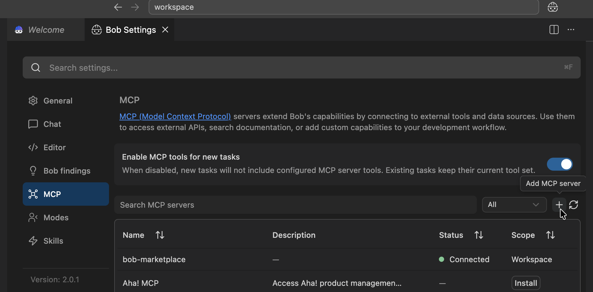
   - Select scope as `workspace`.
   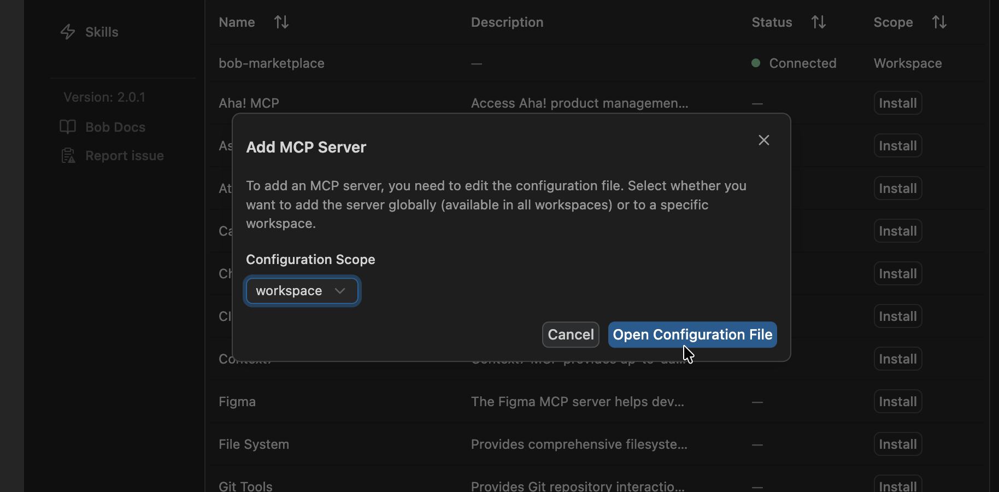

3. **Add configuration:** Update your MCP server configuration file with the following settings:

```json
{
  "mcpServers": {
    "ace-rest-api-bridge": {
      "command": "node",
      "args": [
        "/Users/<your-username>/Desktop/ace-mcp-bridge.js"
      ],
      "timeout": 120,
      "alwaysAllow": [],
      "env": {
        "ACE_MCP_URL": "http://127.0.0.1:7750/mcp",
        "NODE_TLS_REJECT_UNAUTHORIZED": "0"
      }
    }
  }
}
```

**Configuration parameters:**
- **command:** Node.js runtime used to execute the bridge script.
- **args:** Path to your `ace-mcp-bridge.js` file (replace `<your-username>` with your actual username).
- **timeout:** Connection timeout in seconds (120 seconds = 2 minutes).
- **ACE_MCP_URL:** URL of your ACE MCP server endpoint from the ACE Web UI MCP config page.
- **NODE_TLS_REJECT_UNAUTHORIZED:** Set to `"0"` for development (disables SSL verification).

> **Important:**
> - Replace `<your-username>` with your actual system username.
> - Ensure the path to `ace-mcp-bridge.js` is correct for your system.
> - The `NODE_TLS_REJECT_UNAUTHORIZED: "0"` setting should only be used in development environments. For production, configure proper SSL certificates and remove this setting.

4. **Save the configuration:** Save the configuration file.
5. **Restart Bob IDE:** Restart Bob IDE to apply the MCP server configuration.

#### Step 6: Test the MCP Server

**Prompt:**
```
List all available tools from the remote MCP server
```

**Expected output:**
```
Successfully retrieved all available tools from the remote MCP server at http://127.0.0.1:7751/mcp

Available Tools:

1. CountryAPI_getCountries
   - Title: Get all countries
   - Description: Get all countries
   - Input Parameters:
     - query (required):
       - limit (integer, optional)

2. CountryAPI_getCountryName
   - Title: Info for a specific country
   - Description: Info for a specific country
   - Input Parameters:
     - path (required):
       - countryName (string, required): The name of the country to retrieve

3. CountryAPI_postCountries
   - Title: Add a country to the list of countries
   - Description: Add a country to the list of countries
   - Input Parameters:
     - body (required):
       - name (string, required)
       - abbreviation (string, required)
       - capital (string, required)
       - population (integer, required)

All three tools are related to the CountryAPI application deployed on the IBM App Connect Enterprise server. They provide functionality to:
- Retrieve all countries (with optional limit)
- Get information about a specific country by name
- Add new countries to the database
```

**Prompt:**
```
Get the names of countries from remote server
```

**Expected output:**
```
Successfully retrieved the list of countries from the remote MCP server:

Countries Available:

United Kingdom
  Abbreviation: UK
  Capital: London
  Population: 67,530,172

France
  Abbreviation: FR
  Capital: Paris
  Population: 65,129,728

Germany
  Abbreviation: DE
  Capital: Berlin
  Population: 83,517,045

The data was retrieved by calling the CountryAPI_getCountries tool on the remote MCP server running at http://127.0.0.1:7751/mcp through the ace-mcp-bridge.
```

---

## Additional Resources

- [IBM App Connect Enterprise Documentation](https://www.ibm.com/docs/en/app-connect)
- [IBM Developer Tutorials](https://developer.ibm.com/tutorials/)
- [Build integration projects faster with IBM Bob and App Connect Enterprise](https://developer.ibm.com/tutorials/accelerate-integration-development-app-connect-ibm-bob/)

---

## Contributing

Contributions are welcome! Please feel free to submit a pull request.

## License

This project is provided as-is for educational purposes.
