# IBM Bob Shell Labs for App Connect Enterprise Toolkit

## Overview
This hands-on lab guide teaches you how to use **IBM Bob Shell** — an AI-powered assistant integrated into the IBM App Connect Enterprise (ACE) Toolkit. You'll learn to leverage Bob Shell's natural language interface to create message flows, generate ESQL code, and analyze existing implementations.

## What You'll Learn
- Launch and interact with IBM Bob Shell in ACE Toolkit
- Use Bob Shell to create simple and complex message flows
- Generate ESQL code through conversational prompts
- Analyze and document existing message flows and ESQL code
- Apply best practices recommended by Bob Shell

## Table of Contents
1. [Lab 1: Launching IBM Bob Shell in ACE Toolkit](#lab-1-launching-ibm-bob-shell-in-ace-toolkit)
2. [Lab 2: Using Bob Shell to Create a Simple HTTP Echo Message Flow](#lab-2-using-bob-shell-to-create-a-simple-http-echo-message-flow)
3. [Lab 3: Using Bob Shell to Create a Complex XML to JSON Transformation Flow](#lab-3-using-bob-shell-to-create-a-complex-xml-to-json-transformation-flow)
4. [Lab 4: Using Bob Shell to Analyze Existing input.xml to JSON Message Using Compute Node](#lab-4-using-bob-shell-to-analyze-existing-inputxml-to-json-message-using-compute-node)
5. [Lab 5: Using Bob Shell to Analyze Existing Artifacts](#lab-5-using-bob-shell-to-analyze-existing-artifacts)

---

## Lab 1: Launching IBM Bob Shell in ACE Toolkit

### Objective
Learn how to access, launch, and interact with the IBM Bob Shell — your AI-powered assistant for ACE development.

### Prerequisites

#### Installation
- [IBM Bob Shell](https://bob.ibm.com/docs/shell/getting-started/install-and-setup#installation)
- [ACE Toolkit 13.0.X](https://www.ibm.com/docs/en/app-connect/13.0.x?topic=gsace-download-app-connect-enterprise-evaluation-edition-get-started)
- [Configuring the IBM Bob Shell in the ACE Toolkit](https://community.ibm.com/community/user/blogs/ben-thompson1/2026/05/21/using-ibm-bob-in-the-ace-toolkit?campaign=socialselling&share=86b75077-12aa-4291-a133-5badbb601617&channel=linkedin&userID=98837841-6793-434d-a9e6-3de6ffa65992&advocacy_source=everyonesocial&es_id=a1d0dbe09c#Skills)

### What is IBM Bob Shell?
IBM Bob Shell is an intelligent conversational interface embedded in the ACE Toolkit that understands natural language commands and helps you:
- Generate message flows and ESQL code
- Debug and troubleshoot issues
- Explain complex ACE concepts
- Review and optimize your implementations
- Follow ACE best practices

### Steps

#### Step 1.1: Open the ACE Toolkit
1. Launch the **IBM App Connect Enterprise Toolkit** from your applications menu.
2. Wait for the workspace to load completely.
3. Ensure you're in the **Integration Development** perspective.
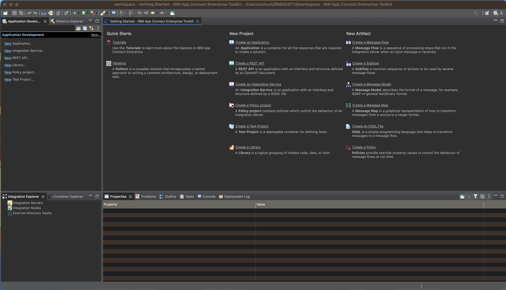

    - If you do not see that view, go to `Window` → `Perspective` → `Open Perspective` → `Integration Development`.

#### Step 1.2: Open IBM Bob Shell within ACE Toolkit
1. Look for the **Terminal** icon in the toolbar.
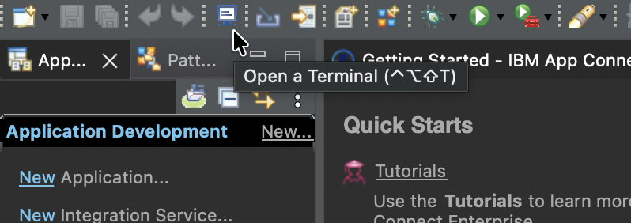
2. Once the Bob panel opens, you should see a **chat interface** with an input field.
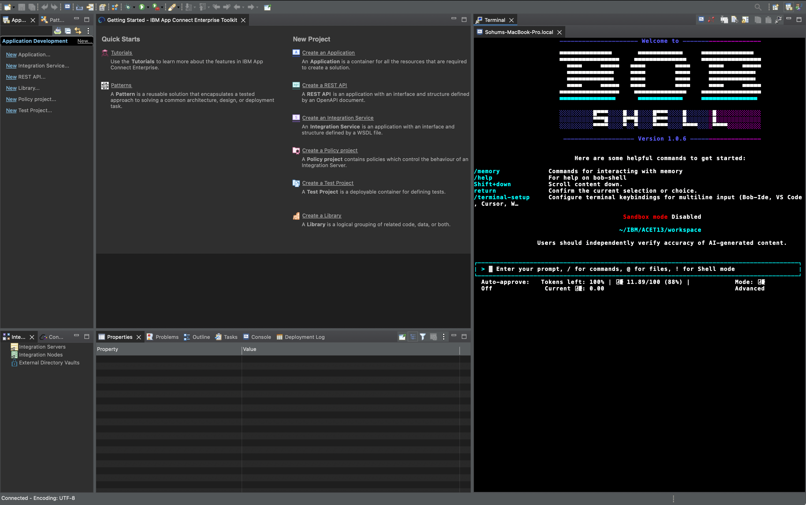


#### Step 1.3: Explore Bob Shell Capabilities
1. **Ask Bob about its capabilities**:
   ```
   What can you help me with in ACE development?
   ```

2. **Review Bob's response**, which should cover:
   - Creating message flows from descriptions
   - Generating ESQL code for transformations
   - Debugging flows and troubleshooting errors
   - Explaining existing code and flows
   - Providing best practices recommendations
   - Optimizing performance
   - Security analysis

3. **Test Bob's understanding** with a follow-up:
   ```
   Can you explain what an HTTPInput node does?
   ```

4. **Verify** that Bob provides a clear, accurate explanation.

5. **Ask Bob for guidance**, for example:
   ```
   Create a comprehensive guide for moving App Connect Enterprise integrations to containers.
   What are the considerations to move an App Connect Enterprise integration to containers?
   ```

#### Step 1.4: Practice Basic Bob Shell Commands
Try these commands to familiarize yourself with Bob Shell:

1. **Ask about best practices**:
   ```
   What are the best practices for error handling in ACE message flows?
   ```

2. **Request code examples**:
   ```
   Show me an example of iterating through an XML array in ESQL
   ```

### Expected Outcome
- ✅ IBM Bob Shell is active and responsive
- ✅ You can interact with Bob through natural language
- ✅ Help commands are accessible

---

## Lab 2: Using Bob Shell to Create a Simple HTTP Echo Message Flow

### Objective
Learn how to use IBM Bob Shell's natural language interface to design and create a basic message flow that receives HTTP requests and echoes the data back to the client.

### Key Learning Points
- Describing requirements to Bob Shell in natural language
- Following Bob's step-by-step guidance
- Validating your work with Bob Shell
- Iterating based on Bob's recommendations

### Prerequisites
- Completed Lab 1
- Understanding of basic HTTP concepts

### Steps

#### Step 2.1: Create a New Application Project
1. **Open the IBM Bob Shell** chat interface.
2. **Type a detailed prompt** describing what you want to build:
   ```
   Use the ace-bob skill to help create me an ACE message flow which takes in HTTP content and echoes it back to the requester. Create this flow in an application called Echo
   ```


#### Step 2.2: Follow Bob's Guided Instructions
1. **Read Bob's response carefully**. Bob should provide:
   - Overview of the solution architecture
   - List of nodes needed
   - Step-by-step creation instructions
   - Configuration details for each node

2. **Ask clarifying questions** if needed to better understand the implementation.

3. **Request Bob to explain concepts** if any part is unclear.

### Expected Outcome
- ✅ Create Echo application project directory
- ✅ Create `.project` file with correct natures and buildSpec
- ✅ Create `.settings` directory and `org.eclipse.core.resources.prefs` file
- ✅ Create `application.descriptor` file
- ✅ Create `HTTPEcho.msgflow` with HTTP Input and HTTP Reply nodes
- ✅ Provide import instructions to user

#### Step 2.3: Import the Project into ACE Toolkit
1. **Open the import wizard** by going to `File` → `Import...`
2. **Select import existing project**, navigating to `General` → `Existing projects into workspace`.
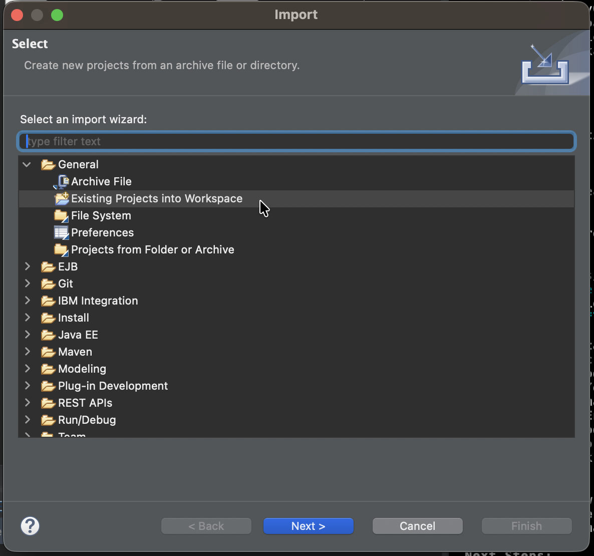
3. **Open the Echo app directory**.
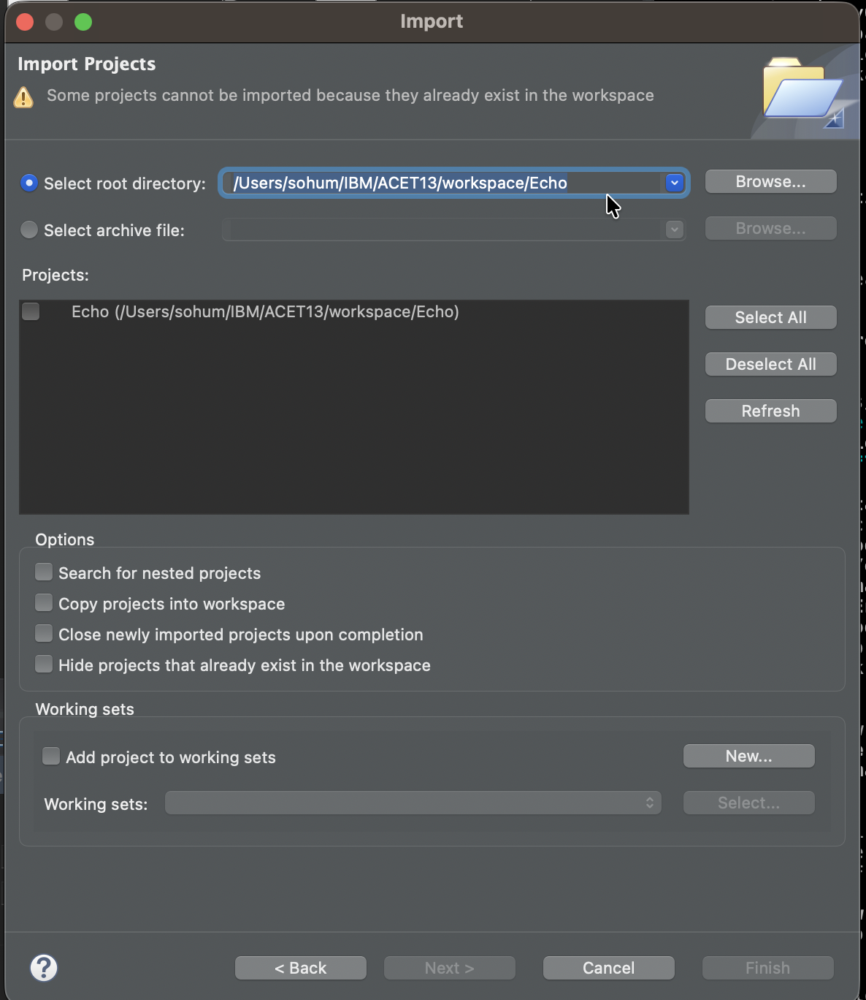


#### Step 2.4: Deploy and Test

1. **Create an integration server configuration in ACE:**
   - Right-click on **Integration servers** → **Create a local integration server**.
   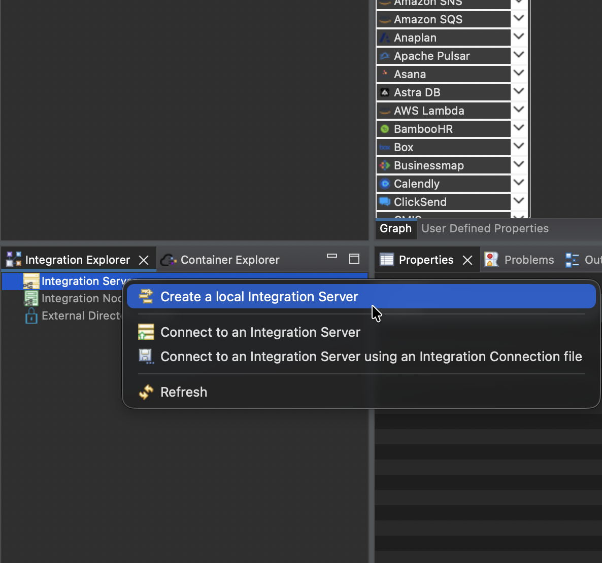

2. **Create a new BAR file:**
   - Right-click on `Echo` → `New` → `BAR file`.
   - Name it `Echo.bar`.
   - Add the application and click **Build and Save**.
   

3. **Deploy the application:**
   - Right-click on `Echo` → `Deploy to Integration Server`.
   - Select your server and click **Deploy**.
   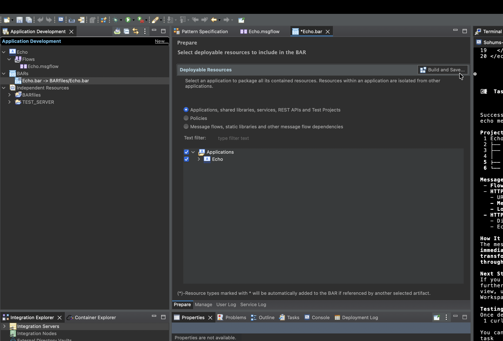

4. **Test using Flow Exerciser or curl:**

    1. **Flow Exerciser:**
        - Start the Flow Exerciser by clicking the icon while viewing the `Echo.msgflow` file.
        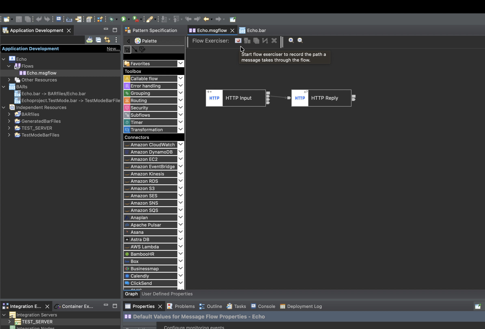

        - Click to send a test message.
        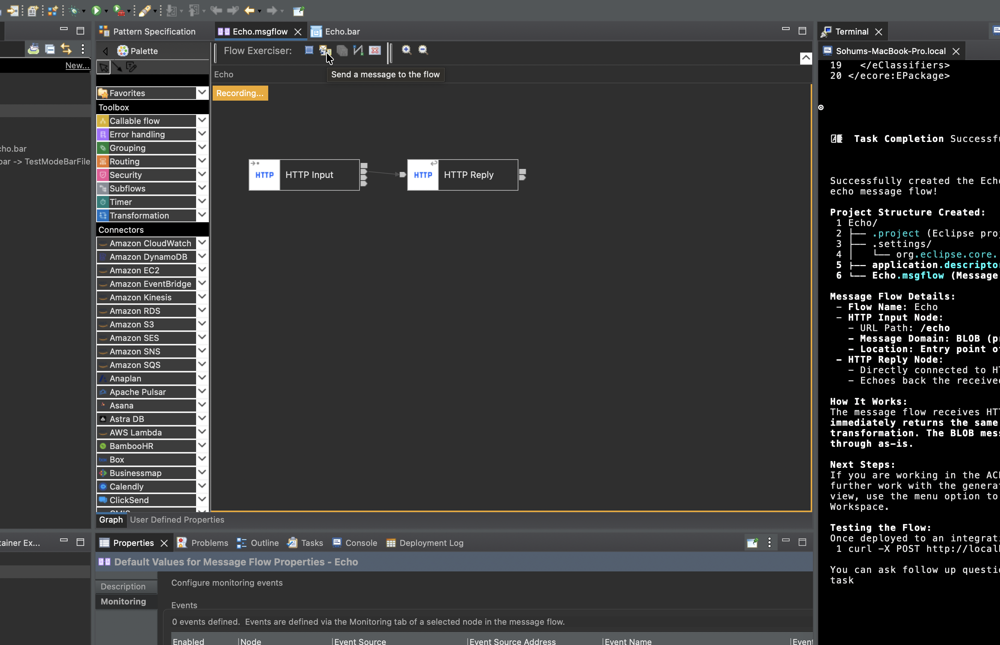

        - Add a new message.
        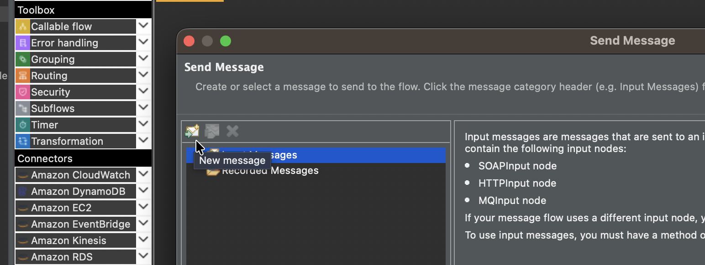

        - Enter `hello world` and click **Send Message**.
        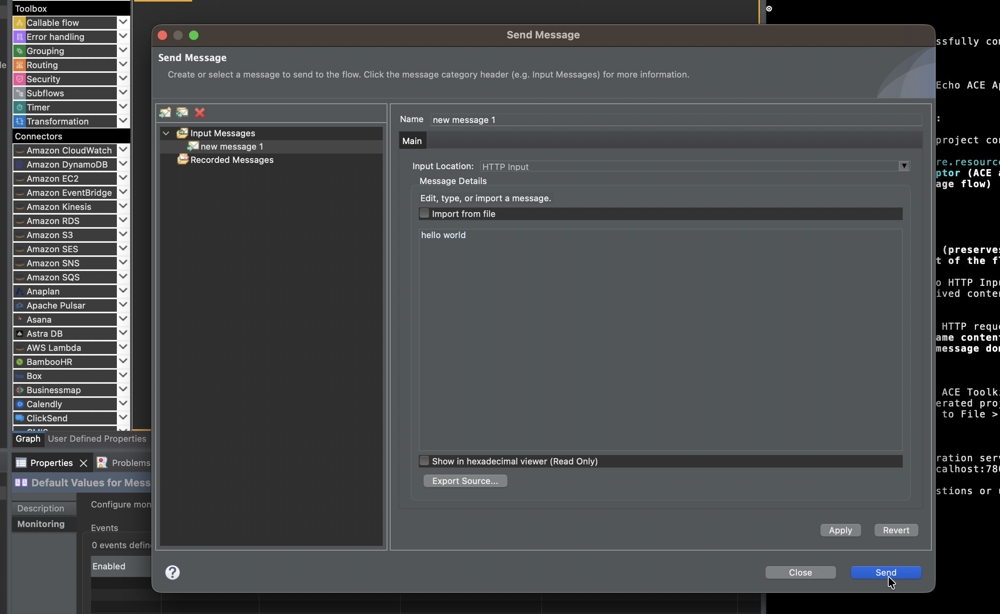

        - See the HTTP response as expected: `hello world`.
        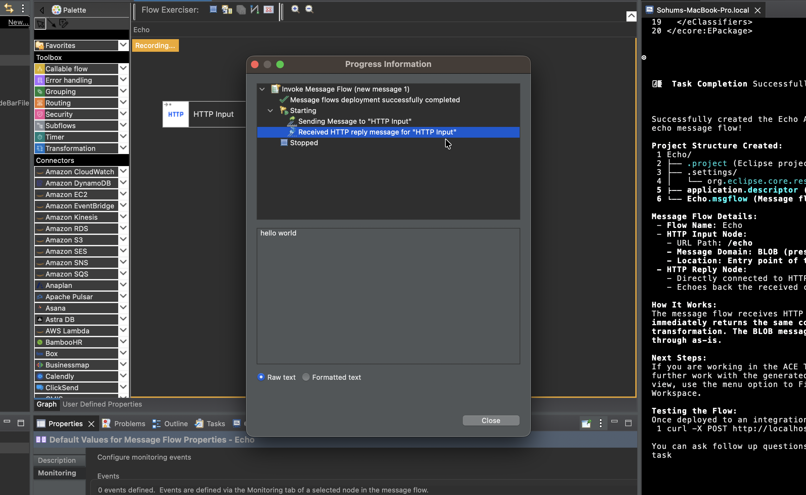

    2. **Alternative — curl method:**
        ```bash
        curl -X POST http://localhost:7800/echo \
        -H "Content-Type: application/json" \
        -d '{"message": "Hello ACE"}'
        ```


### Validation Checklist
- ✅ Message flow created successfully
- ✅ HTTP endpoint responds on `/echo` path
- ✅ Request body is echoed back in the response
- ✅ Bob provided helpful guidance throughout

### Sample Test Results
**Request:**
```json
{
  "message": "Hello ACE",
  "timestamp": "2026-05-27T17:00:00Z"
}
```

**Response:**
```json
{
  "message": "Hello ACE",
  "timestamp": "2026-05-27T17:00:00Z"
}
```

---

## Lab 3: Using Bob Shell to Create a Complex XML to JSON Transformation Flow

### Objective
Learn how to leverage IBM Bob Shell to design and implement an advanced message flow with ESQL-based transformations, converting XML input to JSON output with data manipulation.

### Key Learning Points
- Describing complex transformation requirements to Bob Shell
- Generating ESQL code through conversational prompts
- Iterating on code with Bob's assistance
- Understanding Bob's code explanations

### Prerequisites
- Completed Lab 1
- Basic understanding of XML and JSON formats
- Familiarity with ESQL (helpful but not required)

### Steps

#### Step 3.1: Describe Complex Requirements to Bob Shell
1. **Open IBM Bob Shell**:
   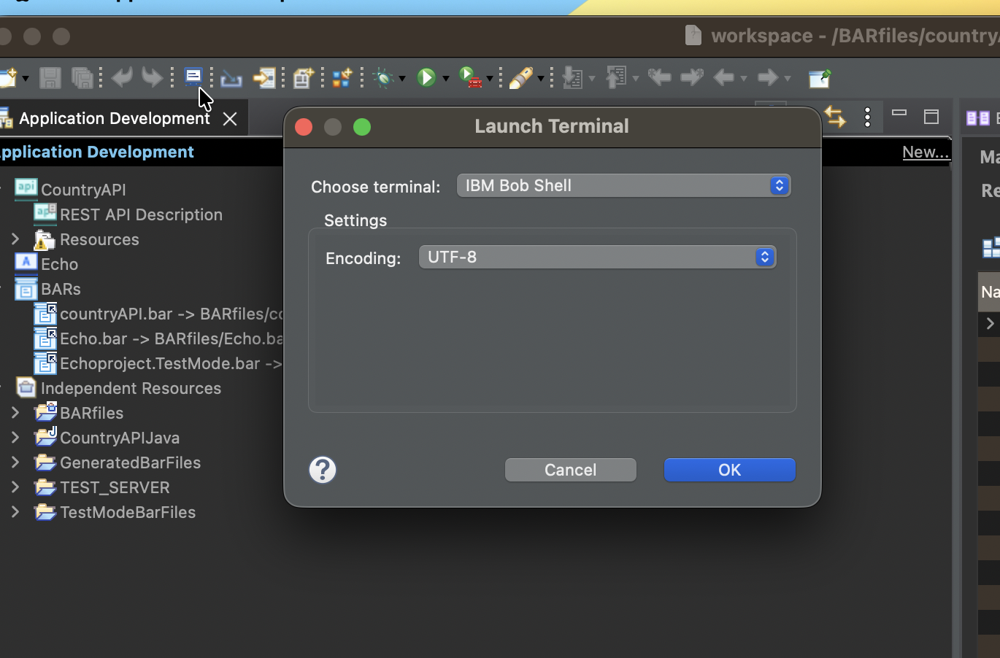

2. **Provide a comprehensive prompt**:
   ```
   I need to create a message flow called XMLtoJSON that transforms customer data from XML to JSON format. Here are the requirements:

   INPUT: XML with this structure:
   - Customer/CustomerID
   - Customer/Name/FirstName and LastName (nested)
   - Customer/Email
   - Customer/Orders/Order (array) with OrderID and Amount

   OUTPUT: JSON with this structure:
   - customerId (from CustomerID)
   - fullName (combine FirstName + LastName)
   - email (copy as-is)
   - orders array (transform each Order)
   - totalAmount (sum of all order amounts)

   FLOW DESIGN:
   - HTTPInput node on /transform path accepting XML
   - Compute node with ESQL for transformation logic
   - HTTPReply node to return JSON

   Can you help me design this flow and generate the ESQL code on application called XMLTransformation
   ```

3. **Wait for Bob's response** outlining the solution.

    - Expect something similar to:
    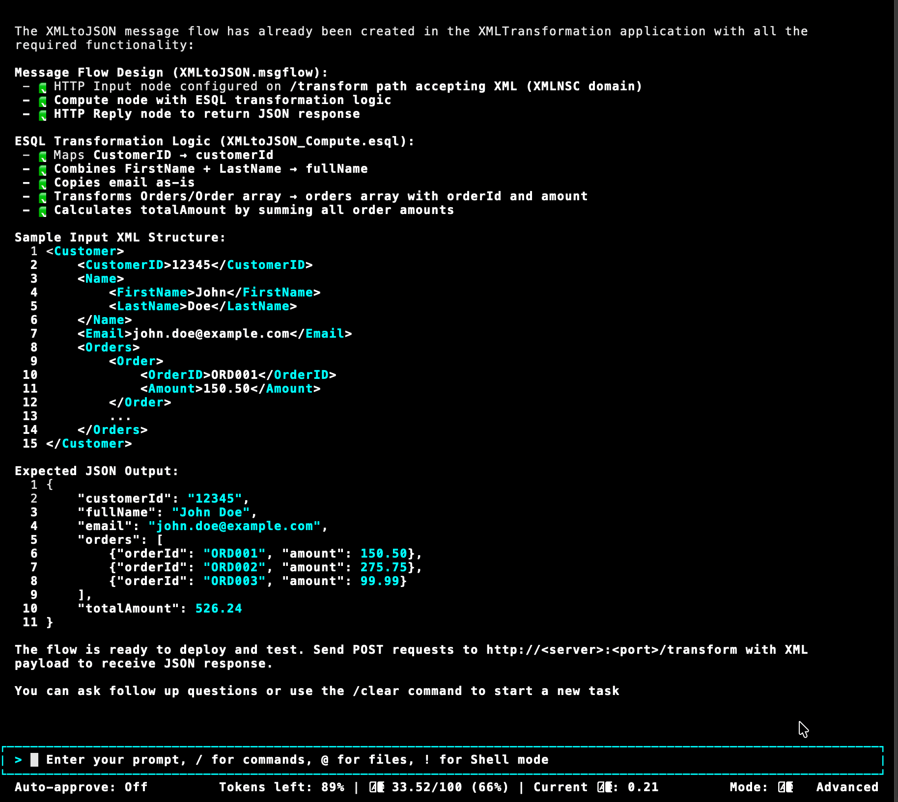

4. **Ask Bob to break it down** if the response is too complex:
   ```
   Can you break this down into smaller steps? Let's start with the message flow structure first.
   ```

#### Step 3.2: Review Bob's Response

Bob should provide:
- Overview of the solution architecture
- List of nodes needed
- Step-by-step creation instructions
- Configuration details for each node

**Ask clarifying questions** if needed to better understand the implementation.

### Expected Outcome
- ✅ Create `XMLTransformation` application project directory structure
- ✅ Create `.project` file with ACE application natures
- ✅ Create `.settings` directory and preferences file
- ✅ Create `application.descriptor` file
- ✅ Create `XMLtoJSON.msgflow` with HTTP Input, Compute, and HTTP Reply nodes
- ✅ Create ESQL file with XML to JSON transformation logic
- ✅ Provide import instructions to user

#### Step 3.3: Import the Project into ACE Toolkit
1. **Open the import wizard** by going to `File` → `Import...`
2. **Select import existing project**, navigating to `General` → `Existing projects into workspace`.
    
3. **Navigate to the XMLTransformation root directory**.
    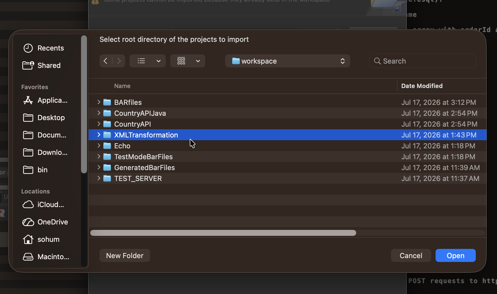
4. **Open the XMLTransformation app directory**.
    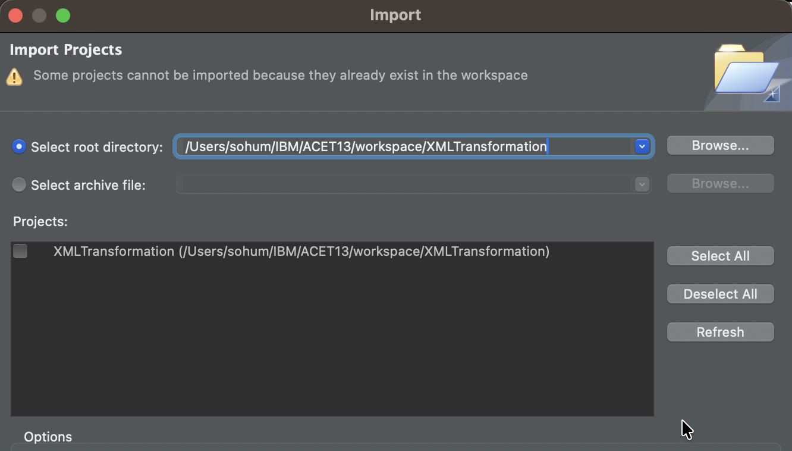

#### Step 3.4: Test Flow
**Send Request:**
1. In the **Application Development** pane, open `XMLTransformation` → `XMLtoJSON.msgflow`.
2. Start the Flow Exerciser / Start Recording (or click the Flow Exerciser icon).
    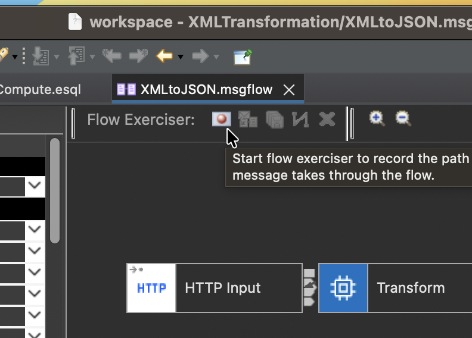
3. Click `Ok` to push the flow to an integration server.
    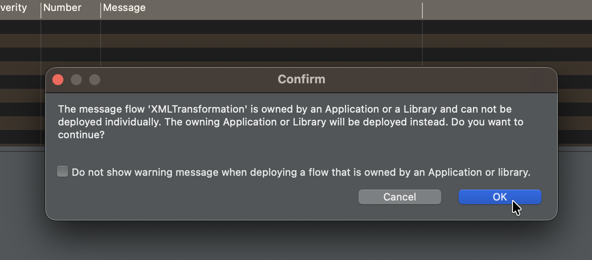
4. Navigate to **Send Message** to create a sample input message.
    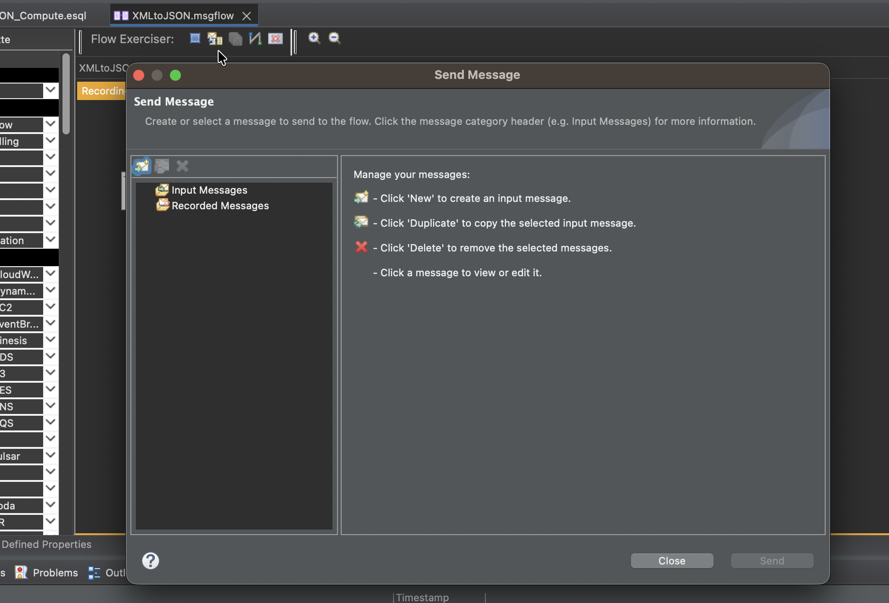
5. Create this message:
    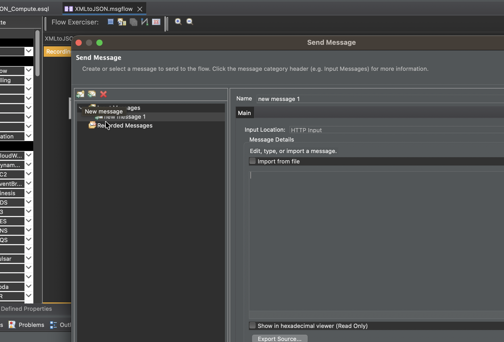

    Paste this XML message in **Message Details**:
    ```xml
    <?xml version="1.0" encoding="UTF-8"?>
    <Customer>
        <CustomerID>CUST12345</CustomerID>
        <Name>
            <FirstName>John</FirstName>
            <LastName>Smith</LastName>
        </Name>
        <Email>john.smith@example.com</Email>
        <Orders>
            <Order>
                <OrderID>ORD001</OrderID>
                <Amount>150.50</Amount>
            </Order>
            <Order>
                <OrderID>ORD002</OrderID>
                <Amount>275.75</Amount>
            </Order>
            <Order>
                <OrderID>ORD003</OrderID>
                <Amount>89.99</Amount>
            </Order>
        </Orders>
    </Customer>
    ```
6. Send the message.
    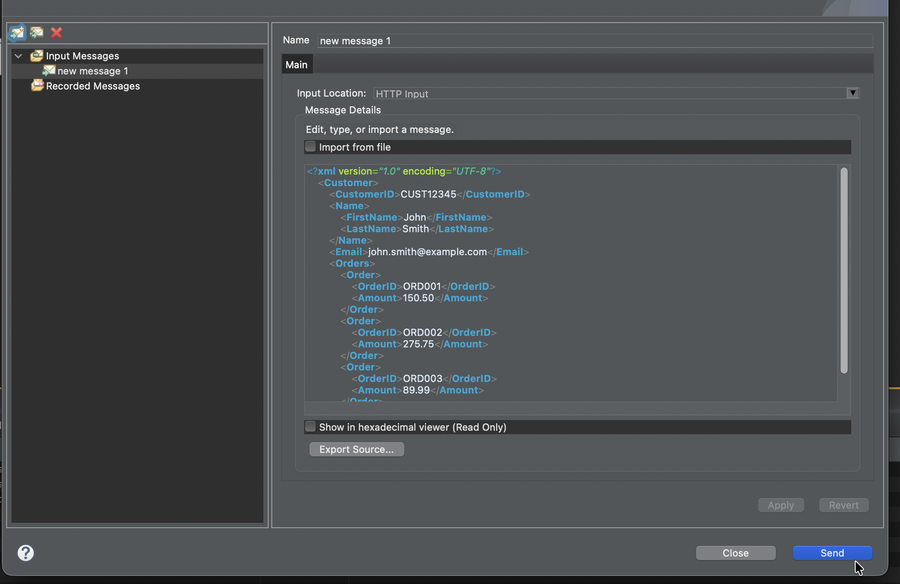

    > **Note:** If you face errors, give Bob Shell your input to make changes and repeat as necessary.

7. The Flow Exerciser will highlight the path and capture the input and output message assemblies for each node.

    Expected response:
    ```json
    {
      "customerId" : "CUST12345",
      "fullName" : "John Smith",
      "email" : "john.smith@example.com",
      "orders" : {
          "orderId" : "ORD003",
          "amount" : 89.99
      },
      "totalAmount" : 516.24
    }
    ```
    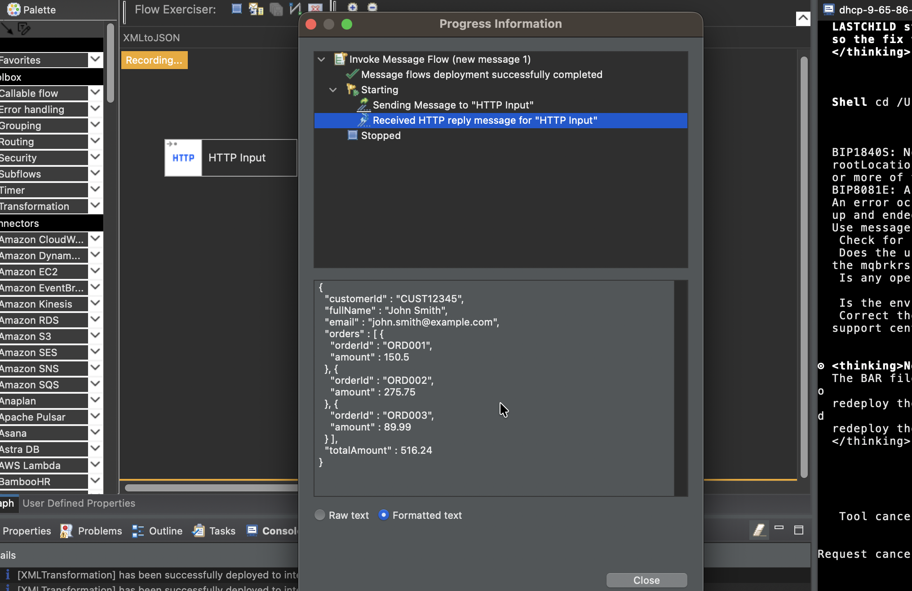

---

## Lab 4: Using Bob Shell to Analyze Existing input.xml to JSON Message Using Compute Node

### Objective
Learn how to use IBM Bob Shell to create a file-based message flow that reads XML input, transforms it to JSON using a Compute node, and writes the output to a file.

### Prerequisites
- Completed Lab 1
- Basic understanding of file-based message flows
- Familiarity with XML and JSON formats

### Steps

#### Step 4.1: Create a New Application Named Example

1. Create a new application.
    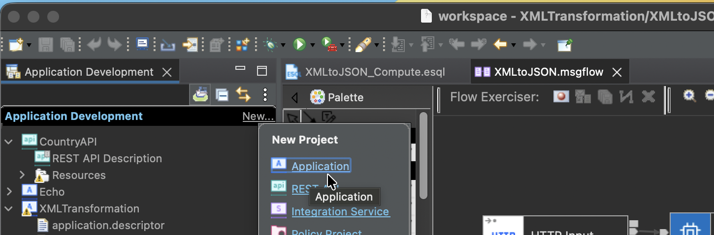
2. Create a new `input.xml` by right-clicking on the `Example` app → `New...` → `Other...` → search for `xml` → `XML File`.
    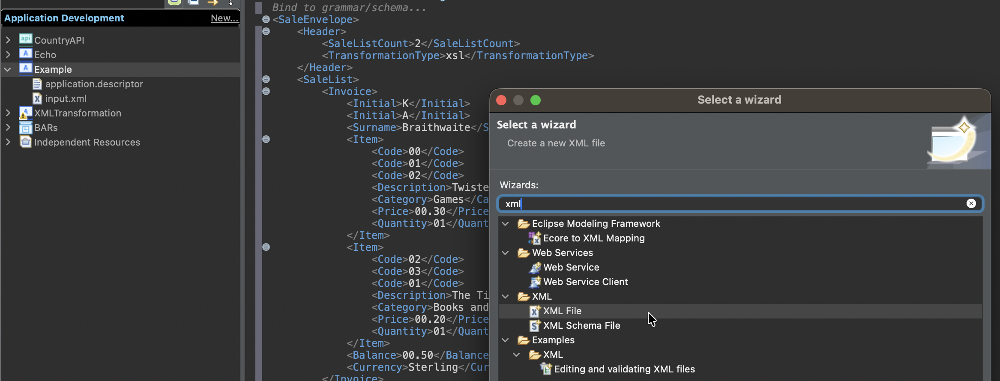

3. Right-click `input.xml` and select `Open with...` → `Basic text editor`, then paste the following XML:
    ```xml
        <?xml version="1.0" encoding="UTF-8"?>
        <SaleEnvelope>
            <Header>
                <SaleListCount>2</SaleListCount>
                <TransformationType>xsl</TransformationType>
            </Header>
            <SaleList>
                <Invoice>
                    <Initial>K</Initial>
                    <Initial>A</Initial>
                    <Surname>Braithwaite</Surname>
                    <Item>
                        <Code>00</Code>
                        <Code>01</Code>
                        <Code>02</Code>
                        <Description>Twister</Description>
                        <Category>Games</Category>
                        <Price>00.30</Price>
                        <Quantity>01</Quantity>
                    </Item>
                    <Item>
                        <Code>02</Code>
                        <Code>03</Code>
                        <Code>01</Code>
                        <Description>The Times Newspaper</Description>
                        <Category>Books and Media</Category>
                        <Price>00.20</Price>
                        <Quantity>01</Quantity>
                    </Item>
                    <Balance>00.50</Balance>
                    <Currency>Sterling</Currency>
                </Invoice>
                <Invoice>
                    <Initial>T</Initial>
                    <Initial>J</Initial>
                    <Surname>Dunnwin</Surname>
                    <Item>
                        <Code>04</Code>
                        <Code>95</Code>
                        <Code>01</Code>
                        <Description>The Origin of Species</Description>
                        <Category>Books and Media</Category>
                        <Price>22.34</Price>
                        <Quantity>02</Quantity>
                    </Item>
                    <Item>
                        <Code>05</Code>
                        <Code>12</Code>
                        <Code>03</Code>
                        <Description>Monopoly Board Game</Description>
                        <Category>Games</Category>
                        <Price>15.99</Price>
                        <Quantity>01</Quantity>
                    </Item>
                    <Balance>60.67</Balance>
                    <Currency>Sterling</Currency>
                </Invoice>
            </SaleList>
        </SaleEnvelope>
    ```

#### Step 4.2: Open IBM Bob Shell
1. Open Bob Shell.
    
2. Provide a comprehensive prompt:
    ```
    Create me an ACE message flow inside the project called Example which reads in a file called input.xml, and transforms it to a JSON message using a Compute node and writes the content to an output file called output.json
    ```

> **Note:** If you do not see the newly generated files, right-click on the `Example` app and click **Refresh**.
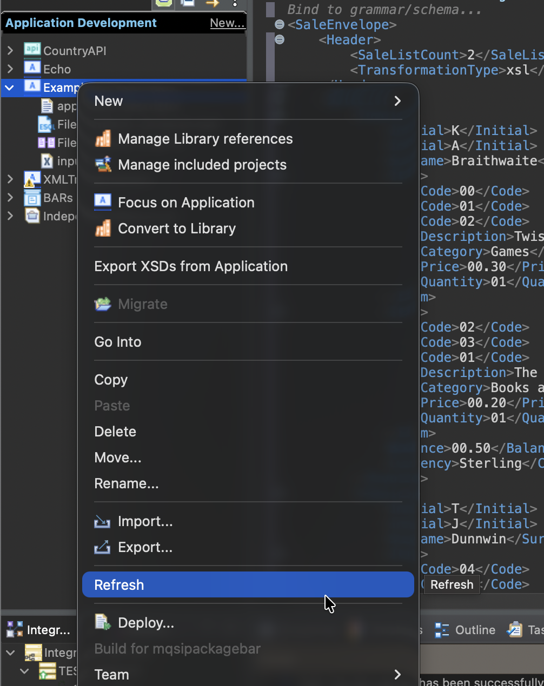

### Expected Outcome
- ✅ Create `Example` application project structure
- ✅ Create `.project` file with proper natures and buildSpec
- ✅ Create `.settings` directory and `org.eclipse.core.resources.prefs`
- ✅ Create `application.descriptor` file
- ✅ Create `FileTransform.msgflow` with File Input, Compute, and File Output nodes
- ✅ Create ESQL file for Compute node with XML to JSON transformation
- ✅ Verify all files are created correctly

### Next Steps
1. If you are working in the ACE Toolkit and have not yet imported the application, go to `File` → `Import` → `Existing Projects into Workspace` to see the results and continue working with the generated project in the Application Development view.
2. Create the input and output directories on your system.
3. Adjust the directory paths in the File Input and File Output nodes as needed for your environment.
4. Deploy the flow to your integration server.
5. Place an `input.xml` file in the input directory to trigger the transformation.

### Sample Test Results
**Request:**
Check the `output.json` file by right-clicking it and selecting **Open With** → **Text Editor**.

---

## Lab 5: Using Bob Shell to Analyze Existing Artifacts

### Objective
Learn how to use IBM Bob Shell to analyze and understand existing ACE artifacts, including message flows and ESQL code from IBM's tutorial gallery.

### Prerequisites
- Completed Lab 1
- Access to ACE Toolkit Tutorials Gallery

### Steps

#### Step 5.1: Navigate to ACE Toolkit Tutorials
1. Navigate to **ACE Toolkit** → `Help` → `Tutorials Gallery`.
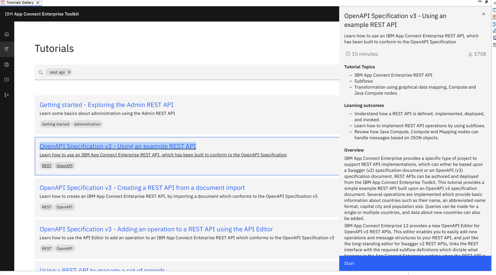

#### Step 5.2: Search for Transformation Tutorial
1. In the search bar, type `Transformation` and press **Enter**.
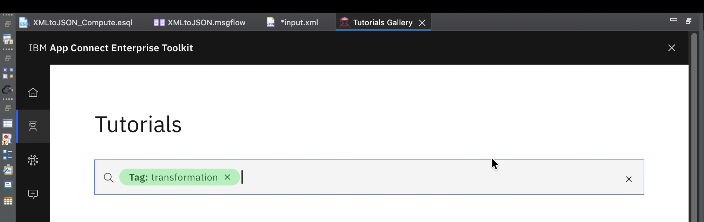

#### Step 5.3: Select the Tutorial
1. Scroll down and select the tutorial shown below.
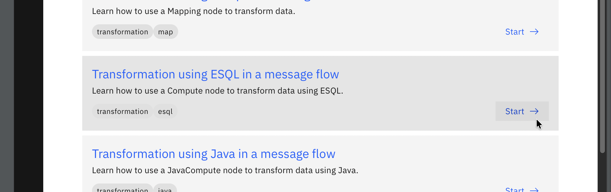
2. Click **Start** to import it.
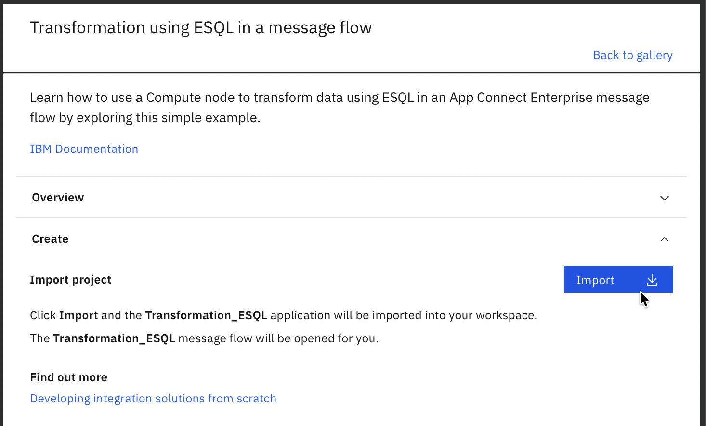

#### Step 5.4: Analyze with Bob Shell
1. Navigate to the Bob Terminal and enter the following prompt:
```
Explain the purpose of the message flow called Transformation ESQL including a summary of the Compute node's ESQL Logic!
```

### Expected Outcome
Bob will provide a comprehensive explanation of the message flow and the ESQL logic in the Compute node.

```txt
## Transformation_ESQL Message Flow Purpose
The Transformation_ESQL message flow is a web service that transforms XML invoice data into a different XML statement format. It receives HTTP requests containing sales invoices and returns reformatted monthly statements.

## Message Flow Architecture
The flow consists of three nodes:
1. HTTP Input - Receives HTTP requests at /Transformation_ESQL endpoint with XMLNSC domain
2. Compute - Transforms the input XML structure using ESQL logic
3. HTTP Reply - Returns the transformed XML response

## Compute Node ESQL Logic Summary
The Transformation_Compute module performs the following transformation:

**Input Structure:** SaleEnvelope/SaleList/Invoice elements containing:
- Customer initials and surname
- Balance
- Multiple Item elements (Description, Price, Quantity)
- Currency

**Output Structure:** SaleEnvelope/SaleList/Statement elements containing:
- Statement attributes (Type="Monthly", Style="Full")
- Customer information (combined Initials, Name, Balance)
- Purchases with Article elements
- Total Amount with Currency attribute

**Key Transformation Logic:**
1. Iterates through each Invoice using WHILE loop with reference navigation
2. Creates Statement elements with Monthly/Full attributes
3. Combines customer initials from two Initial fields into one
4. Processes each Item within an invoice:
   - Applies 1.6x markup to the price (60% markup)
   - Creates Article elements with Description, Cost, and Quantity
   - Calculates running total
5. Sets final Amount with currency attribute
6. Preserves message headers from input to output
```
