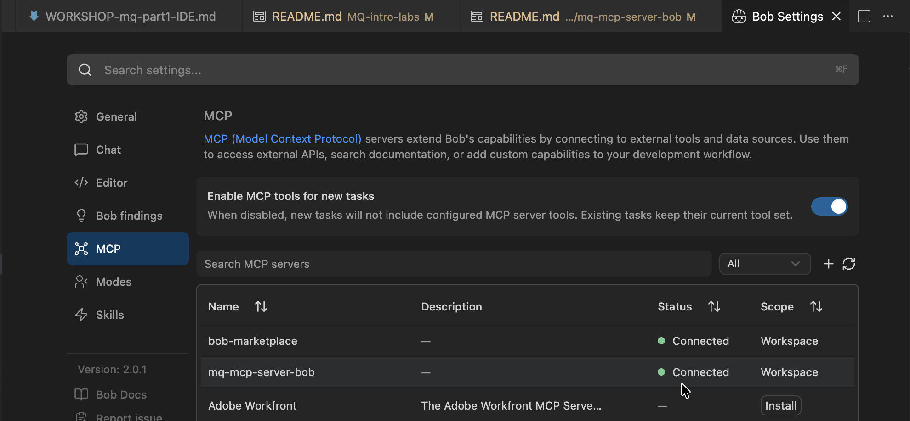

# MQ MCP Server for Bob — Setup Guide

This guide sets up the IBM MQ container and the MQ MCP Server so that Bob can manage IBM MQ using natural language. When you reach the ✅ at the end, return to the [workshop README](../README.md#step-2-start-the-workshops) to begin the labs.

## Overview

The MQ MCP Server exposes IBM MQ administrative operations through the Model Context Protocol (MCP), giving Bob three tools to work with:

| Tool | What it does |
|------|-------------|
| `dspmq` | List all queue managers and their running status |
| `get_status` | Get MQ status as JSON (for dashboards and monitoring) |
| `runmqsc` | Execute any MQSC command against a queue manager |

---

## Before You Start

Make sure you have the following:

- [ ] **IBM Bob** installed
- [ ] **Python 3.10+** — verify with `python --version`
- [ ] **Podman Desktop** or **Docker** — for running the MQ container
- [ ] **Terminal / Command Prompt** access

---

## Step 1: Start IBM MQ

Choose the tab for your platform.

---

### Linux / Windows (x86_64)

**Using Docker:**
```bash
docker run \
  --env LICENSE=accept \
  --env MQ_QMGR_NAME=QM1 \
  --env MQ_APP_USER=app \
  --env MQ_APP_PASSWORD=passw0rd \
  --env MQ_ADMIN_USER=admin \
  --env MQ_ADMIN_PASSWORD=passw0rd \
  --volume qm1data:/mnt/mqm \
  --publish 1414:1414 \
  --publish 9443:9443 \
  --detach \
  --name QM1 \
  icr.io/ibm-messaging/mq:latest
```

**Using Podman:**
```bash
podman volume create qm1data

podman run \
  --env LICENSE=accept \
  --env MQ_QMGR_NAME=QM1 \
  --env MQ_APP_USER=app \
  --env MQ_APP_PASSWORD=passw0rd \
  --env MQ_ADMIN_USER=admin \
  --env MQ_ADMIN_PASSWORD=passw0rd \
  --volume qm1data:/mnt/mqm \
  --publish 1414:1414 \
  --publish 9443:9443 \
  --detach \
  --name QM1 \
  icr.io/ibm-messaging/mq:latest
```

Verify the container is running:
```bash
podman ps   # or: docker ps
```

---

### macOS Apple Silicon (M1/M2/M3/M4)

> ⚠️ **Important:** IBM MQ containers do **not** natively support ARM64. You must run them under x86_64 emulation via Rosetta.

**1. Install Podman Desktop**

Download and install from: https://podman-desktop.io/

**2. Configure the Podman machine for x86_64 emulation**

```bash
podman machine stop

podman machine set --rootful

podman machine start
```

**3. Pull the IBM MQ image with the platform flag**

```bash
podman pull --platform linux/amd64 icr.io/ibm-messaging/mq:latest
```

> You'll see a platform mismatch warning — this is expected and normal.

**4. Create a data volume and start the container**

```bash
podman volume create qm1data

podman run \
  --env LICENSE=accept \
  --env MQ_QMGR_NAME=QM1 \
  --env MQ_APP_USER=app \
  --env MQ_APP_PASSWORD=passw0rd \
  --env MQ_ADMIN_USER=admin \
  --env MQ_ADMIN_PASSWORD=passw0rd \
  --volume qm1data:/mnt/mqm \
  --publish 1414:1414 \
  --publish 9443:9443 \
  --detach \
  --name QM1 \
  icr.io/ibm-messaging/mq:latest
```

> You may see `AMQ6209W` / `AMQ6183W` SIGTRAP warnings in the logs — these are normal Rosetta emulation artefacts and do not affect functionality.

**5. Verify the container is running**

```bash
podman ps
```

You should see `QM1` listed.

**6. Test the MQ REST API**

```bash
curl -k https://localhost:9443/ibmmq/rest/v3/admin/qmgr/
```

Any JSON response (including an authentication error) confirms MQ is reachable.
If an error is returned by `curl` then wait a few moments for the QM1 to be ready and retry.

> **Performance note:** Rosetta emulation is slightly slower than native x86_64 but is fully functional for lab purposes.

---

## Step 2: Install uv

`uv` is used to run the MCP server.

**macOS / Linux:**
```bash
curl -LsSf https://astral.sh/uv/install.sh | sh
source $HOME/.cargo/env
```

**Windows (PowerShell):**
```powershell
powershell -ExecutionPolicy ByPass -c "irm https://astral.sh/uv/install.ps1 | iex"
```

Verify:
```bash
uv --version
```

---

## Step 3: Install MCP Server Dependencies

```bash
cd mq-mcp-server-bob
uv pip install httpx fastmcp "mcp[cli]"
```

---

## Step 4: Configure the MCP Server

Open `bob-mcp-config.json` in this directory and update two things:

**1. Set the absolute path to `mqmcpserver_bob.py`:**

```json
"args": ["run", "/absolute/path/to/mq-mcp-server-bob/mqmcpserver_bob.py"]
```

To find your absolute path:
```bash
# macOS / Linux
pwd

# Windows
cd
```

Example values:
- macOS/Linux: `"/Users/yourname/Desktop/MQ/mq-mcp-server-bob/mqmcpserver_bob.py"`
- Windows: `"C:/Users/yourname/Desktop/MQ/mq-mcp-server-bob/mqmcpserver_bob.py"`

**2. Set your MQ credentials** (defaults work for the lab container):

```json
{
  "mcpServers": {
    "mq-mcp-server-bob": {
      "command": "uv",
      "args": ["run", "/absolute/path/to/mq-mcp-server-bob/mqmcpserver_bob.py"],
      "env": {
        "MQ_HOST": "localhost",
        "MQ_PORT": "9443",
        "MQ_USER": "admin",
        "MQ_PASSWORD": "passw0rd"
      }
    }
  }
}
```

**Environment variable reference:**

| Variable | Default | Description |
|----------|---------|-------------|
| `MQ_HOST` | `localhost` | MQ server hostname |
| `MQ_PORT` | `9443` | MQ REST API port |
| `MQ_USER` | `admin` | MQ admin username |
| `MQ_PASSWORD` | `passw0rd` | MQ admin password |

---

## Step 5: Import the MCP Server into Bob

1. Open **IBM Bob**
2. Switch to **Agent Mode**
3. Go to **Settings → MCP Servers**
4. Click **"Import MCP Server"**
5. Navigate to the `mq-mcp-server-bob` directory
6. Select `bob-mcp-config.json`
7. Click **"Import"**

Look for a **green indicator** next to `mq-mcp-server-bob` — this confirms it connected successfully.


---

## Step 6: Verify the Setup

In the Bob chat, type:

```
List all MQ queue managers
```

---

## ✅ Setup Complete

If Bob responded with `QM1` showing status `Running`, you are ready to start the workshops.

**👉 [Return to the workshop README to begin the labs](../README.md#step-2-start-the-workshops)**

---

## Troubleshooting

### "Cannot connect to MQ"
- Check the container is running: `podman ps` or `docker ps`
- Test the REST API: `curl -k https://localhost:9443/ibmmq/rest/v3/admin/qmgr/`
- Check firewall settings for port 9443

### "Authentication failed"
- Double-check credentials in `bob-mcp-config.json` match `admin` / `passw0rd`
- Ensure the MQ user has `MQWebAdmin` role
- Check `mqwebuser.xml` if you have customised MQ security

### "Module not found"
- Run `uv sync` or `pip install -r requirements.txt`
- Verify Python version is 3.10+: `python --version`

### MCP server not connecting in Bob
- Verify the path in `bob-mcp-config.json` is an **absolute** path
- Use forward slashes `/` even on Windows
- Restart Bob after making path changes
- Check Settings → MCP Servers logs for the specific error

### Testing the server outside Bob

Run standalone (press `Ctrl+C` to stop):
```bash
uv run mqmcpserver_bob.py
```

Or use the interactive FastMCP inspector:
```bash
uv run fastmcp dev mqmcpserver_bob.py
```

This opens a web UI where you can call `dspmq`, `get_status`, and `runmqsc` directly.

---

## About This Server

This is a Bob-compatible fork of the IBM MQ MCP Server. Key differences from the original:

| Change | Detail |
|--------|--------|
| Transport | `stdio` instead of `streamable-http` — required for Bob |
| Error handling | Improved messages and logging |
| Security | JSON encoding for MQSC commands (no string concatenation) |
| Configuration | Ready-to-use `bob-mcp-config.json` included |

---

## License

Copyright (c) 2025 IBM Corp. Licensed under the [Apache License, Version 2.0](https://www.apache.org/licenses/LICENSE-2.0).
